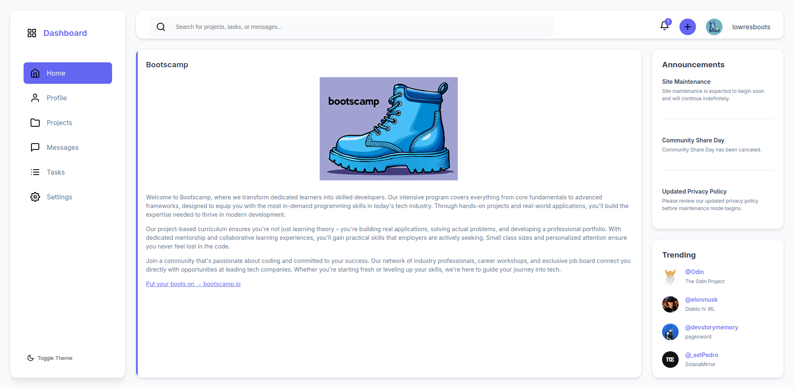
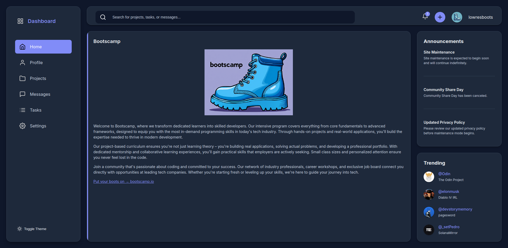

# Modern Admin Dashboard

A project created as part of [The Odin Project](https://www.theodinproject.com/)'s curriculum. This admin dashboard demonstrates the implementation of a modern web interface using CSS Grid, Flexbox, and vanilla JavaScript.

The dashboard features project cards, user notifications, trending items, and a sleek dark/light theme toggle. It showcases the practical application of advanced CSS layout techniques and interactive JavaScript features in a real-world design context.

  
  &nbsp;&nbsp;
  

## Features

- Dark/Light theme with system persistence
- Responsive grid layout
- Interactive notification system
- Modern design with smooth transitions
- Built with vanilla HTML/CSS/JS (no frameworks)
- CSS Grid and Flexbox for layout
- Theme preference saved to localStorage